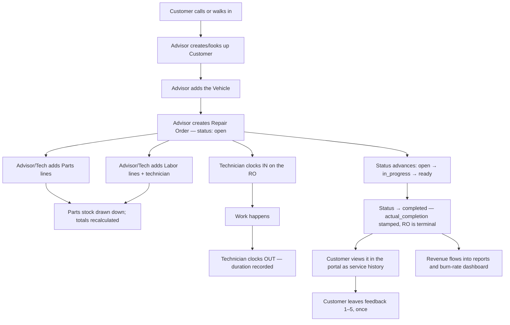

# AG Shop Pro — Product Overview and Complete System Walkthrough

> **Audience:** Anyone who needs to understand what AG Shop Pro is — owners, managers,
> advisors, technicians, customers, administrators, developers, DevOps, support, and
> pilot coordinators.
>
> **Status of this document:** Written from the actual source code in this repository
> (verified with the Graphify knowledge graph) as of the `staging` branch. Where a
> behaviour could not be verified from the repository it is marked **UNVERIFIED**.

---

## Table of Contents

1. [What AG Shop Pro is](#1-what-ag-shop-pro-is)
2. [Who it is for](#2-who-it-is-for)
3. [The business problem it solves](#3-the-business-problem-it-solves)
4. [User roles](#4-user-roles)
5. [The major modules](#5-the-major-modules)
6. [How the modules work together](#6-how-the-modules-work-together)
7. [The complete auto-repair workflow](#7-the-complete-auto-repair-workflow)
8. [Multi-shop and workspace isolation](#8-multi-shop-and-workspace-isolation)
9. [Deployment model](#9-deployment-model)
10. [What is supported today](#10-what-is-supported-today)
11. [What is not supported today](#11-what-is-not-supported-today)
12. [Known pilot limitations](#12-known-pilot-limitations)
13. [End-to-end walkthrough (data model in motion)](#13-end-to-end-walkthrough-data-model-in-motion)
14. [Glossary of product terminology](#14-glossary-of-product-terminology)
15. [Related documents](#15-related-documents)

---

## 1. What AG Shop Pro is

AG Shop Pro is a **multi-tenant, web-based management platform for independent auto
repair shops**. A single deployment hosts many separate shops ("workspaces"); each shop
manages its own customers, vehicles, repair orders, parts inventory, staff, reports, and
a customer-facing self-service portal, and can never see another shop's data.

Technically it is a **Node.js / Express JSON API** backed by **PostgreSQL**, serving a
**static HTML/JavaScript frontend** (no build step, no single-page-app framework). The
API and the frontend are served from the same origin on one port. The system is deployed
on a single **AWS EC2** host behind **Nginx**, run under **PM2**, with the database on
**AWS RDS PostgreSQL**.

There are two front doors:

| Door | URL (local dev) | Who signs in |
|---|---|---|
| **Staff app** | `http://localhost:3000/login.html` | Shop owners/managers, service advisors, technicians, and AG platform staff |
| **Customer portal** | `http://localhost:3000/portal-login.html` | A shop's customers, once portal access is enabled for them |

---

## 2. Who it is for

- **Repair-shop owners / managers** — run the whole shop: staff, repair orders, parts,
  reports, customer-portal provisioning, and data import.
- **Service advisors (front desk)** — create and manage customers, vehicles, repair
  orders, and appointments.
- **Technicians (bay staff)** — work assigned repair orders, add labor, and clock
  time in/out.
- **Customers** — view their own service history and vehicles, request/cancel
  appointments, update their profile, and leave feedback — through the portal.
- **Platform administrators (AG staff)** — the `super_admin` role: review shop signups,
  manage the full user directory, and reach any workspace.
- **Developers / DevOps / support** — maintain, deploy, and support the platform.

---

## 3. The business problem it solves

Independent shops typically juggle several disconnected tools (paper tickets,
spreadsheets, a separate scheduling app, a separate accounting export). AG Shop Pro
consolidates the operational core of a shop into one system:

- A single record of every **customer** and their **vehicles**.
- A structured **repair-order lifecycle** with enforced status transitions, so a ticket
  cannot skip from "open" straight to "completed".
- **Parts inventory** that draws down automatically as parts are consumed on repair
  orders, with low-stock visibility.
- **Technician time tracking** tied to the repair order being worked.
- **Business reporting** (revenue, technician performance, customer value, parts
  profitability) derived from the shop's real repair-order data — not a separate ledger.
- A **customer self-service portal** that reduces phone traffic for "what did you do to
  my car / when can I come in".

---

## 4. User roles

Roles are the **tenant boundary**. They are defined in the database (`users.role`) and
enforced by the API middleware (`requireAuth([...])`) and inside the service layer.

| Role | Created by | Scope | Can do |
|---|---|---|---|
| `super_admin` | **Directly in the DB / by AG staff only** — never by signup | **Every** workspace | Review the shop signup queue, see the full user directory, act in any workspace, deactivate/reactivate users |
| `manager` | Automatically when a shop signup is **approved** | Its **own** workspace(s) only | Full control of the shop: repair orders, parts, staff, reports, portal provisioning, CSV import |
| `service_advisor` | Invited by a manager/super_admin | Its workspace | Customers, vehicles, repair orders, appointments |
| `technician` | Invited by a manager/super_admin | Its workspace | Assigned repair orders, labor lines, time clock, RO status |
| **Customer** | A manager enables portal access for them | Their **own** records | Portal: history, vehicles, appointments, profile, feedback |

> ⚠️ **Critical rule (enforced in code):** A shop that signs up becomes a `manager`, not a
> `super_admin`. Migration `008_signup_owner_role.sql` exists specifically to demote any
> shop owner that an earlier version of the signup flow wrongly created as `super_admin`
> — that bug let one shop read and write every other shop's data. Never grant
> `super_admin` to a shop. See [Section 8](#8-multi-shop-and-workspace-isolation).

Customers are **not** rows in the `users` table. They are `customers` rows with their own
password hash (`portal_password_hash`) and their own session store
(`customer_sessions`). **Staff sessions and customer sessions are separate and are not
interchangeable** — a staff token cannot authenticate the portal and vice versa (this is
covered by an integration test).

---

## 5. The major modules

Each backend module is a service class (or function set) in `api/services/`, wired into
routes in `api/server.js`. Graphify identifies these five service classes as the most
connected "god nodes" in the codebase.

| Module | File | Responsibility |
|---|---|---|
| **Repair Orders** | `services/repair-order.js` | RO lifecycle, parts/labor lines, totals, technician time tracking |
| **Parts & Inventory** | `services/parts.js` | Parts catalog, stock levels, inventory adjustments, search |
| **Customers** | `services/customer.js` | Customer records, their vehicles, full service history |
| **Vehicles** | `services/vehicle.js` | Vehicle records owned by a customer |
| **Customer Portal** | `services/customer-portal.js` | Customer auth, history, appointments, feedback, profile |
| **User Management** | `services/user-management.js` | Invites, roles, activation, profile, admin password reset |
| **Reporting & Analytics** | `services/reporting.js` | Financial, technician, customer, parts reports; CSV export |
| **Burn-rate analytics** | `services/analytics.js` | Revenue/margin dashboard derived from completed ROs |
| **Signup provisioning** | `services/signup.js` | Approve/reject/reinstate shop signups; create workspace + owner |
| **CSV import** | `services/import.js` | Bulk import of customers and vehicles |
| **Email** | `services/email.js` | Transactional email (approval, rejection, reinstate, password reset) |
| **Errors / validation** | `services/errors.js` | Typed errors, safe error responses, input parsers |
| **Health** | `src/routes/health.js` | `/api/health` — DB + SMTP checks |
| **Mitchell ETL** | `services/mitchell-etl.js` | **Placeholder only** (see limitations) |

---

## 6. How the modules work together

```
                         Browser (static HTML/JS in public/)
        staff pages ─┐                                   ┌─ portal pages
  login/manager/     │                                   │  portal-login/
  service/tech/      │        same origin, one port      │  portal.html
  superadmin/...     │                                   │
                     ▼                                   ▼
        ┌───────────────────────────────────────────────────────────┐
        │                api/server.js  (Express app)                │
        │  helmet · CORS · rate limits · express.static(public/)     │
        │  requireAuth([roles])         requireCustomerAuth()        │
        └───────────────┬───────────────────────────┬───────────────┘
                        │ delegates to               │
                        ▼                             ▼
        ┌───────────────────────────┐   ┌───────────────────────────┐
        │  Staff services            │   │  CustomerPortalService     │
        │  RepairOrder, Parts,       │   │  (keyed by customer id;    │
        │  Customer, Vehicle, User,  │   │   workspace from the row)  │
        │  Reporting, Analytics,     │   └───────────────────────────┘
        │  Signup, Import            │
        └───────────────┬───────────┘
                        │ parameterized SQL, WHERE workspace_id = $1
                        ▼
        ┌───────────────────────────────────────────────────────────┐
        │            PostgreSQL (AWS RDS in production)               │
        │  workspaces · users · sessions · customers · vehicles ·    │
        │  repair_orders · ro_parts_lines · ro_labor_lines ·         │
        │  time_entries · parts · appointments · feedback ·          │
        │  customer_sessions · shop_signups · signup_audit_log · …   │
        └───────────────────────────────────────────────────────────┘
```

**Design conventions (verified in code):**

- **Thin routes, fat services.** Route handlers in `server.js` do auth, resolve the
  workspace, and delegate. All validation, workspace scoping, status rules, and
  transactions live in `api/services/`.
- **Every staff service method takes a `workspaceId`** and filters on it. The id is
  resolved from the session (`resolveWorkspaceId`), never trusted blindly from the client
  for non-admins.
- **Transactions** (`BEGIN`/`COMMIT`/`ROLLBACK`) wrap every multi-step write.
- **Typed errors** (`ValidationError`, `NotFoundError`, `ConflictError`, …) map to HTTP
  status codes; raw database errors never reach the browser.

---

## 7. The complete auto-repair workflow



**Enforced repair-order status machine** (`services/repair-order.js`, backed by a DB
`CHECK` constraint in migration `007`):

```
draft ──► open ──► in_progress ──► ready ──► completed  (terminal)
             │          │  ▲  │
             │          ▼  │  ▼
             │   awaiting_parts │
             └──────────────────┴──► cancelled  (terminal)

Valid transitions:
  draft          → open, cancelled
  open           → in_progress, awaiting_parts, cancelled
  in_progress    → awaiting_parts, ready, completed, cancelled
  awaiting_parts → in_progress, ready, cancelled
  ready          → completed, cancelled
  completed      → (none)     cancelled → (none)
```

> **Note:** New repair orders are created directly in **`open`** status (not `draft`).
> `draft` exists in the transition table but the create path never sets it.

---

## 8. Multi-shop and workspace isolation

A **workspace** is one shop. Isolation is enforced in three layers:

1. **Data layer.** Almost every tenant table has a `workspace_id` column with a foreign
   key to `workspaces`. Every service query includes `WHERE workspace_id = $1`.
2. **Request layer.** `resolveWorkspaceId(req, res)` picks the workspace from
   `?workspaceId`, the request body, or the session's first workspace. For any non-`super_admin`,
   it **rejects a workspace the user is not a member of** (HTTP 403). A `super_admin` may
   target any workspace.
3. **User membership.** `users.workspace_ids` is an integer array; a user only "sees" the
   workspaces listed there. Managers only see users whose membership overlaps their own.

**Cross-tenant "not found", not "forbidden".** When a record belongs to another
workspace, the API returns **404 Not Found** rather than 403, so record ids cannot be
probed across tenants.

**Why the role matters so much.** `resolveWorkspaceId` *skips the membership allowlist
for `super_admin`*. That is exactly why a shop owner must be a `manager`: if a shop owner
were `super_admin`, they could pass `?workspaceId=<any other shop>` and read/write it.
This was a real, reproduced bug; `services/signup.js` now provisions `manager`, and
migration `008` retroactively fixes any owner still on `super_admin`.

Workspace isolation is covered extensively by the integration tests — customers,
vehicles, repair orders, parts, appointments, reports, and the user directory are each
asserted against a second seeded workspace.

---

## 9. Deployment model

```
GitHub  ──push staging──►  Deploy to Preprod workflow  ──►  preprod.agshopro.com (PM2 :3001)
GitHub  ──push main────►  Deploy to Production workflow ─►  agshopro.com        (PM2 :3000)
        (GitHub "production" environment approval gate + healthcheck + rollback)
```

- **Immutable, timestamped releases** on EC2. Each deploy rsyncs code into
  `releases/<YYYYmmdd_HHMMSS_sha>`, symlinks the shared `.env`, installs prod deps,
  runs migrations, then atomically repoints the `current` symlink and reloads PM2.
- **`current` symlink** → the live release. **Rollback** repoints it to the previous
  release. Old releases are pruned (keep last N).
- **Shared environment file** at `/var/www/<app>/shared/.env` — real secrets live here,
  never in Git.
- **Nginx** terminates TLS (Let's Encrypt), serves `public/`, and reverse-proxies
  `/api/` to the Node process on `127.0.0.1:3000`.

Full detail — including exact commands, the on-server `deploy.sh`/`rollback.sh` scripts
(generated by `server-setup.sh`), health checks, and rollback — is in
[`OPERATIONS_RUNBOOK.md`](OPERATIONS_RUNBOOK.md).

---

## 10. What is supported today

Verified as fully working against the source and the integration test suite (103
integration tests + 20 unit tests):

- Staff login/logout with opaque, database-checked session tokens (8-hour expiry).
- Shop **signup → super_admin review → approval** that provisions a workspace + owner
  (`manager`) and emails temporary credentials.
- **Customers & vehicles** CRUD (create/list/get/update; vehicles updatable), with
  duplicate-email and duplicate-VIN protection scoped per workspace.
- **Repair orders**: create, list, get (with parts/labor/time/feedback), update editable
  fields, enforced status transitions, workspace-unique RO numbers allocated safely under
  concurrency.
- **Parts & labor lines** on a repair order, with automatic stock draw-down for catalog
  parts and recalculated totals.
- **Technician time clock**: clock in/out with one open entry per technician enforced by
  a partial unique index.
- **Parts catalog & inventory**: create/update parts, adjust inventory (never below
  zero), low-stock list, search.
- **Customer portal**: login (workspace-scoped), service history, vehicles, appointment
  request/update/cancel, one-time feedback per completed RO, profile update, password
  change.
- **Staff-side appointments**: list workspace appointments and confirm/advance them.
- **Reporting**: financial summary, technician performance, customer analytics, parts
  analytics, revenue trends, shop KPIs, and CSV/JSON export — all corrected against a
  row-multiplication (fan-out) bug.
- **Burn-rate dashboard** derived from completed repair orders.
- **CSV bulk import** of customers and vehicles.
- **User management**: invite, role change, deactivate/reactivate, admin password reset,
  self-service profile/password.
- **Password recovery** (forgot/reset) with single-use, one-hour tokens.
- **Health endpoint** with DB and SMTP checks.

---

## 11. What is not supported today

Confirmed from the source code:

- **Mitchell 1 ETL integration is a placeholder.** `services/mitchell-etl.js` exports
  `getCustomerHistory` that always returns `null`, and is only `require()`d as a no-op in
  production. The `GET /api/integrations/mitchell/status` endpoint reads real counters
  from `workspace_integrations`/`etl_sync_log`, but nothing populates them via an actual
  sync. Customer history is served by `CustomerService`, not Mitchell.
- **Payment processing / Square integration is not connected.** The burn-rate service
  reports `paymentsIntegration: 'not_connected'` and returns `null` for Square fees and
  refunds (the UI renders "—"). There is no payment capture, invoicing, or POS.
- **No repair-order deletion endpoint.** ROs can be `cancelled` (a status) but not
  deleted; `repair_orders` foreign keys are `ON DELETE RESTRICT` for customer/vehicle.
- **No customer/vehicle delete endpoint** exposed by the API.
- **No parts CSV import route** is wired (the service has `bulkImportParts`, but only
  customer and vehicle CSV import routes exist in `server.js`).
- **No mobile apps.** README lists mobile technician/customer apps as Phase 2 (roadmap).
- **Several npm dependencies are declared but unused** by the current code paths:
  `socket.io`, `redis`/`ioredis`, `jsonwebtoken`, `node-cron`, `bcryptjs`, `csv-writer`,
  `axios`. Sessions are opaque DB tokens (not JWT); there is no real-time/WebSocket
  feature despite the Nginx `socket.io` proxy block. Treat these as planned/leftover.
- **Real-time updates**: pages fetch on load/action; there is no live push.

---

## 12. Known pilot limitations

- **First super_admin must be created manually** by inserting a bcrypt-hashed user
  directly into the database. There is no seeded account and no demo login.
- **Email delivery depends on correct SMTP configuration.** If SMTP is unconfigured
  (e.g. local dev), approval/rejection/reset emails are logged rather than sent; the
  forgot-password flow falls back to logging the reset link to the server log.
- **Temporary passwords are handed over out-of-band.** Approving a signup, inviting a
  user, enabling portal access, and admin password resets all return a temporary password
  in the API response for the operator to relay (and by email where SMTP works).
- **CSV import is customers and vehicles only**, and imported vehicles link to a customer
  only if a matching `customer_email` already exists in the workspace.
- **Reports have no pagination cap surfaced in the UI**; some report queries return all
  rows for the workspace.
- **The `KNOWLEDGE_TRANSFER.md` file is historical** and predates the real
  migration/test/lint scripts — see the correction note in
  [`OPERATIONS_RUNBOOK.md`](OPERATIONS_RUNBOOK.md) and [`docs/README.md`](README.md).
- **`repair_order_feedback` table is dead** (superseded by `feedback`); do not build on
  it.

---

## 13. End-to-end walkthrough (data model in motion)

This traces how the core records connect, from a new customer to a portal review. Each
step names the API route and the tables touched. (Table columns are in
[`TECHNICAL_ARCHITECTURE.md`](TECHNICAL_ARCHITECTURE.md).)

1. **Customer created.** Advisor `POST /api/customers` → row in `customers`
   (`workspace_id`, `full_name`, `email` lower-cased, `phone`). Duplicate email in the
   same workspace is rejected (409).

2. **Vehicle added.** Advisor `POST /api/vehicles` with `customerId` → row in `vehicles`
   (VIN upper-cased, `year`/`mileage` validated). The customer must be in the same
   workspace; duplicate VIN in the workspace is rejected.

3. **Repair order created.** Advisor `POST /api/repair-orders` with `customerId`,
   `vehicleId`, `concern` → row in `repair_orders`, status `open`, a workspace-unique
   `ro_number` (e.g. `RO-1001`) allocated under an advisory lock. The service verifies
   the vehicle belongs to that customer in that workspace.

4. **Technician assigned via labor.** `POST /api/repair-orders/:id/labor` with
   `description`, `hours`, `hourlyRate`, and `technicianId` → row in `ro_labor_lines`.
   The technician must be an active member of the workspace. `line_total = hours × rate`.

5. **Parts added.** `POST /api/repair-orders/:id/parts` → row in `ro_parts_lines`. If a
   catalog `partId` is given, `parts.quantity_on_hand` is drawn down (never below 0) and
   price/cost inherited. `line_total = quantity × unit_price`.

6. **Totals recalculated.** After each parts/labor add, the SQL function
   `recalculate_ro_totals(ro_id)` sets `repair_orders.total_estimate` and `total_final`
   to `parts_total + labor_total`.

7. **Time tracked.** Technician `POST …/time/clock-in` → open row in `time_entries`
   (`end_time` NULL). `POST …/time/clock-out` sets `end_time` and computes
   `duration_minutes`. Only one open entry per technician (partial unique index).

8. **Inventory adjusted (independently).** Manager `POST /api/parts/:id/adjust-inventory`
   with a signed `adjustment` → updates `parts.quantity_on_hand` (transactional, floored
   at 0), logged to the server log.

9. **Completion.** `PATCH /api/repair-orders/:id/status` with `status: "completed"` →
   only from `in_progress` or `ready`. Stamps `actual_completion = NOW()`. The RO is now
   terminal.

10. **Service history.** The customer `GET /api/customer/service-history` (portal) sees
    this RO with its parts, labor, and any feedback — scoped to their own
    `customer_id`.

11. **Customer portal interaction.** The customer can `POST /api/customer/appointments`
    (a future-dated request against their own vehicle → `appointments`, status
    `pending`), and once the RO is `completed`, `POST /api/customer/feedback`
    (rating 1–5, once per RO → `feedback`). Staff see the appointment via
    `GET /api/appointments` and confirm it with `PATCH /api/appointments/:id`.

Every read and write above is scoped to a single workspace (staff side) or a single
customer id (portal side).

---

## 14. Glossary of product terminology

| Term | Meaning |
|---|---|
| **Workspace** | One repair shop (tenant). The isolation boundary. `workspaces` table. |
| **Repair Order (RO)** | A job on one vehicle for one customer. Has a `ro_number`, status, parts, labor, time, totals. |
| **RO number** | Human-facing identifier like `RO-1001`, unique within a workspace. |
| **Parts line** | A part consumed on a repair order (`ro_parts_lines`). May reference the catalog. |
| **Labor line** | Work performed on a repair order by a technician (`ro_labor_lines`). |
| **Time entry** | A technician clock-in/out interval on a repair order (`time_entries`). |
| **Catalog part** | An item in the parts inventory (`parts`), with stock levels. |
| **Inventory adjustment** | A manual signed change to a part's `quantity_on_hand`. |
| **Portal access** | A customer's ability to sign in (`portal_enabled` + `portal_password_hash`). |
| **Appointment** | A customer's service request against their vehicle (`appointments`). |
| **Feedback** | A 1–5 rating + comment a customer leaves once per completed RO (`feedback`). |
| **Signup** | A shop's request to join, pending AG review (`shop_signups`). |
| **Provisioning** | Approving a signup: creating the workspace and the owner (`manager`) account. |
| **super_admin** | AG platform staff role; the only role that crosses workspaces. |
| **manager** | A shop's own admin; full control of its workspace only. |
| **Session token** | Opaque 32-byte random token stored in `sessions` (staff) or `customer_sessions` (portal). |
| **Burn rate** | Revenue/margin dashboard derived from completed repair orders. |

---

## 15. Related documents

- [`README.md`](README.md) — documentation index and reading order
- [`USER_MANUAL.md`](USER_MANUAL.md) — how to use every page, by role
- [`FEATURE_REFERENCE.md`](FEATURE_REFERENCE.md) — feature-by-feature catalog with status
- [`TECHNICAL_ARCHITECTURE.md`](TECHNICAL_ARCHITECTURE.md) — schema, API, developer guide
- [`OPERATIONS_RUNBOOK.md`](OPERATIONS_RUNBOOK.md) — deploy, ops, incident response
- [`PILOT_ONBOARDING.md`](PILOT_ONBOARDING.md) — pilot scope and setup
- [`TRAINING_WALKTHROUGH.md`](TRAINING_WALKTHROUGH.md) — guided live demo script
- [`FAQ_TROUBLESHOOTING.md`](FAQ_TROUBLESHOOTING.md) — symptoms, causes, fixes
- [`MANUAL_ACTIONS_CHECKLIST.md`](MANUAL_ACTIONS_CHECKLIST.md) — everything that must be done by hand
