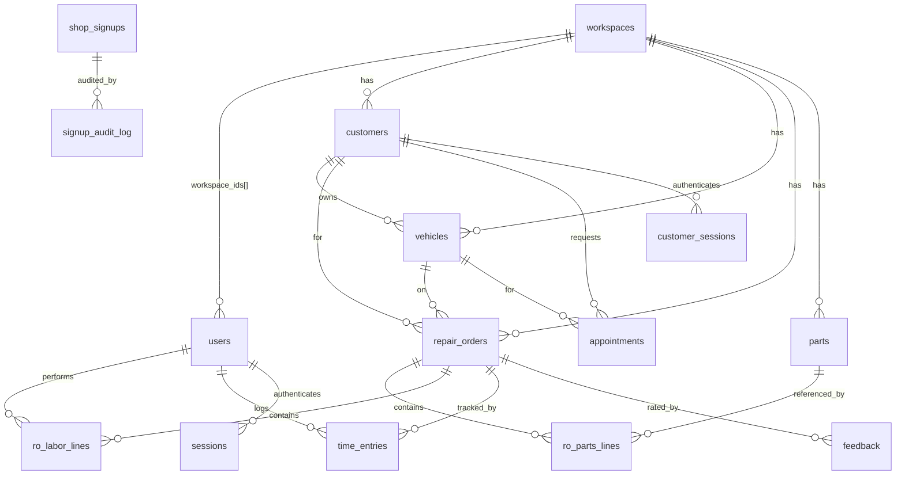

# AG Shop Pro — Technical Architecture and Developer Guide

> **Audience:** Developers and technical maintainers.
> **Source of truth:** the code in this repository, verified with Graphify. All routes,
> tables, and commands below were checked against the actual source on the `staging`
> branch. Items that cannot be verified from the repository are marked **UNVERIFIED**.

---

## Table of Contents

1. [Repository structure](#1-repository-structure)
2. [Technology stack](#2-technology-stack)
3. [Frontend architecture](#3-frontend-architecture)
4. [Backend architecture](#4-backend-architecture)
5. [Request lifecycle](#5-request-lifecycle)
6. [Service-layer conventions](#6-service-layer-conventions)
7. [Database architecture](#7-database-architecture)
8. [Authentication & sessions](#8-authentication--sessions)
9. [Authorization & role permissions](#9-authorization--role-permissions)
10. [Workspace / tenant isolation](#10-workspace--tenant-isolation)
11. [Validation, error handling, logging](#11-validation-error-handling-logging)
12. [Complete API reference](#12-complete-api-reference)
13. [Migrations](#13-migrations)
14. [Testing strategy](#14-testing-strategy)
15. [Local development](#15-local-development)
16. [Environment variables](#16-environment-variables)
17. [Coding conventions & how-to recipes](#17-coding-conventions--how-to-recipes)
18. [Using Graphify when modifying the repository](#18-using-graphify-when-modifying-the-repository)
19. [Known architectural debt & areas requiring caution](#19-known-architectural-debt--areas-requiring-caution)

---

## 1. Repository structure

```
AG/
├── api/                          Node.js/Express backend
│   ├── server.js                 The whole app: middleware, all routes, auth middleware
│   ├── package.json              Deps + scripts (dev, lint, test, migrate:latest)
│   ├── .env.example              Env template (safe placeholders)
│   ├── services/                 Business logic (one file per domain)
│   │   ├── errors.js             Typed errors, sendError(), route(), input parsers
│   │   ├── repair-order.js       RepairOrderService — ROs, parts/labor lines, time
│   │   ├── parts.js              PartsService — catalog + inventory
│   │   ├── customer.js           CustomerService — customers + history
│   │   ├── vehicle.js            VehicleService — vehicles
│   │   ├── customer-portal.js    CustomerPortalService — portal auth + self-service
│   │   ├── user-management.js    UserManagementService — invites, roles, lifecycle
│   │   ├── reporting.js          ReportingService — reports + CSV export
│   │   ├── analytics.js          Burn-rate analytics (getBurnRate, burnRateHandler)
│   │   ├── signup.js             provisionSignup/rejectSignup/reinstateSignup
│   │   ├── import.js             ImportService — CSV customers/vehicles
│   │   ├── email.js              Nodemailer transactional email
│   │   └── mitchell-etl.js       PLACEHOLDER (returns null)
│   ├── src/routes/health.js      GET /api/health handler factory
│   ├── migrations/               001..008 ordered SQL, run by migrate.js
│   ├── scripts/
│   │   ├── migrate.js            Applies pending migrations, tracks schema_migrations
│   │   └── lint.js               Dependency-free lint (parse + safety rules)
│   └── test/
│       ├── unit/validation.test.js   DB-free unit tests
│       ├── integration.test.js       103 tests against a real postgres
│       ├── helpers.js                Drops/recreates test DB, applies migrations
│       └── README.md                 Test setup + coverage
├── public/                       Static frontend (no build step)
│   ├── auth.js                   window.AUTH — staff session + workspace switching
│   ├── api.js                    window.API — staff data layer over AUTH.apiFetch
│   ├── portal-api.js             window.PORTAL — customer portal data layer
│   ├── login.html                Staff sign-in + signup wizard + forgot password
│   ├── reset.html                Password reset (token from email)
│   ├── superadmin.html           super_admin console
│   ├── manager.html              Manager portal
│   ├── service.html              Service advisor console
│   ├── tech.html                 Technician (mobile) console
│   ├── customer-history.html     Staff: per-customer history
│   ├── burnrate.html             Burn-rate dashboard (Chart.js from CDN)
│   ├── integrations.html         Mitchell status + CSV import
│   ├── vendors.html              Static parts-vendor reference (no API)
│   ├── docs.html                 Public help center (STATIC; partly aspirational)
│   ├── portal-login.html         Customer sign-in (shop picker)
│   └── portal.html               Customer portal app
├── infra/
│   ├── nginx/agshopro.conf       Production Nginx vhost template
│   └── pm2/ecosystem.config.js   PM2 apps: ag-api (:3000), ag-api-preprod (:3001)
├── .github/workflows/
│   ├── ci.yml                    Lint + unit + migration + integration on PR/push
│   ├── deploy-preprod.yml        push staging → preprod.agshopro.com
│   └── deploy-prod.yml           push main → agshopro.com (approval + rollback)
├── server-setup.sh               One-time EC2 bootstrap; writes deploy.sh/rollback.sh
├── README.md                     App README (quick start, roles, deploy summary)
├── AGENTS.md                     Repository guidelines (conventions)
├── KNOWLEDGE_TRANSFER.md         HISTORICAL ops narrative (partly outdated — see §19)
└── graphify-out/                 Graphify knowledge graph (graph.json, report, html)
```

---

## 2. Technology stack

| Layer | Technology |
|---|---|
| Runtime | Node.js 24 (CI uses Node 24), CommonJS modules |
| Web framework | Express 5 |
| Database | PostgreSQL (AWS RDS in prod), driver `pg` (pooled, max 10) |
| Auth hashing | `bcrypt` (cost 12) |
| Security | `helmet` (explicit CSP), `express-rate-limit`, `cors` |
| File upload | `multer` (memory storage, 10 MB limit) — CSV import |
| CSV parsing | `csv-parser` |
| Email | `nodemailer` |
| Process mgr | PM2 (fork mode, 1 instance) |
| Reverse proxy | Nginx + Let's Encrypt TLS |
| CI/CD | GitHub Actions |
| Frontend | Hand-written HTML + vanilla JS, `Chart.js` (CDN) on one page only |

**Declared-but-unused dependencies** (present in `package.json`, no runtime usage found):
`axios`, `bcryptjs`, `csv-writer`, `ioredis`, `redis`, `jsonwebtoken`, `node-cron`,
`socket.io`. Sessions are opaque DB tokens (not JWT); there is no Redis, cron, or
WebSocket feature wired, despite the Nginx `socket.io` proxy block. Do not assume these
are in use.

---

## 3. Frontend architecture

- **No build step.** `public/` is plain HTML + vanilla JS served directly (by Express in
  dev via `express.static`, by Nginx in prod). Each page is a self-contained
  mini-SPA with inline `<script>` and `onclick` handlers (the CSP explicitly allows
  `'unsafe-inline'` for this reason).
- **Three shared JS modules:**
  - `auth.js` → `window.AUTH`: staff session in `sessionStorage['agshopro_session']`
    (`{ token, id, name, email, role, workspaceIds, activeWorkspaceId, ... }`).
    `AUTH.apiFetch()` attaches `Authorization: Bearer <token>`; on HTTP 401 it clears the
    session and redirects to `login.html`. `requireRoles([...])` gates a page (advisory —
    the API re-checks). `switchWorkspace()` changes the active workspace.
  - `api.js` → `window.API`: staff data layer over `AUTH.apiFetch`. `request()` auto-injects
    `workspaceId` (from the active workspace) into the query/body unless `workspace:false`.
    Provides named endpoint helpers and UI helpers (`money`, `date`, `toast`, `load`,
    `onSubmit`, field-error mapping). Throws `ApiError(message, status, body)`.
  - `portal-api.js` → `window.PORTAL`: customer portal layer. Session in
    `sessionStorage['agshopro_portal_session']`. Same bearer/401 pattern, redirect to
    `portal-login.html`.
- **Role → page mapping (client-side gate; the API is the real gate):**

  | Page | Allowed roles |
  |---|---|
  | `superadmin.html` | `super_admin` |
  | `manager.html` | `manager`, `super_admin` |
  | `service.html` | `service_advisor`, `manager`, `super_admin` |
  | `tech.html` | `technician`, `manager`, `super_admin` |
  | `burnrate.html`, `customer-history.html`, `vendors.html` | `manager`, `service_advisor`, `super_admin` |
  | `integrations.html` | `manager`, `super_admin` |
  | `portal.html` | customers (portal session) |
  | `login.html`, `portal-login.html`, `reset.html`, `docs.html` | public |

- **Sessions live in `sessionStorage`**, so they end when the browser tab closes. This is
  intentional and matches the "sessions expire when you close the tab" behaviour.

---

## 4. Backend architecture

`api/server.js` is the single application file. It:

1. Loads env (`dotenv`), configures a `pg` type parser so `DATE` columns pass through as
   `YYYY-MM-DD` strings (avoids a timezone off-by-one day).
2. Applies middleware: `helmet` (explicit CSP allowing inline scripts + jsDelivr +
   Google Fonts), `cors` (allow-list of origins), `express.json({limit:'10mb'})`,
   `express.urlencoded`, and two rate limiters.
3. Serves `public/` statically (so dev is one port).
4. Creates one `pg.Pool` and instantiates each service once against it.
5. Declares every route inline, each wrapped with `requireAuth([...])` (or
   `requireCustomerAuth()` for portal) and, for most, the `route(context, handler)` async
   error wrapper.
6. Ends with `/api/*` 404 fallback and a last-resort error handler.

The server module exports `app` and `pool` and only calls `app.listen()` when run
directly (`require.main === module`) — so tests import the app without binding a port.

---

## 5. Request lifecycle

```
Browser → Nginx (TLS, /api/ proxy, rate limit 15r/s burst 30)
        → Express app
          → helmet / cors / json body parse
          → rate limiter (authLimiter on credential routes, writeLimiter on signup)
          → requireAuth([roles])            (staff)   or  requireCustomerAuth()  (portal)
              • reads "Authorization: Bearer <token>"
              • staff: SELECT session JOIN users WHERE token=$1 AND expires_at>NOW()
              • rejects 401 (no/expired token) or 403 (role not allowed)
              • sets req.session = { user_id, role, workspace_ids, ... }
          → route(context, handler) wrapper  (catches thrown errors → sendError)
              → resolveWorkspaceId(req,res)  (staff data routes) → 400/403 or workspaceId
              → service.method(workspaceId, data, actorId)
                  • validates input (parseId/parseNumber/requireString/…)
                  • BEGIN … parameterized SQL scoped by workspace_id … COMMIT
                  • throws ValidationError/NotFoundError/ConflictError on rule breaks
              → res.json(result)
          → error handler: AppError → its status; pg error → mapped safe message; else 500
```

---

## 6. Service-layer conventions

Every service (verified across all files) follows the same shape:

- **Constructor takes the pool:** `new RepairOrderService(pool)`.
- **Every public method takes `workspaceId`** (staff services) and filters on it.
- **Transactions** for multi-step writes: `client = await pool.connect(); BEGIN; …;
  COMMIT;` with `ROLLBACK` on error and `client.release()` in `finally`.
- **Row locking** where correctness needs it: `FOR UPDATE`, and a per-workspace
  `pg_advisory_xact_lock` for RO-number allocation.
- **Whitelisted updatable fields.** PATCH payloads are mapped through a fixed
  `{ field: { column, parse } }` table (see `UPDATABLE_FIELDS`, `WRITABLE`,
  `PROFILE_FIELDS`, `APPOINTMENT_FIELDS`). Unknown keys are ignored — SQL is never built
  from caller-supplied object keys (the lint rule enforces this).
- **Typed errors** thrown, never raw strings, so routes map them to HTTP status.
- **Cross-tenant records return "not found"** (404), not "forbidden".

---

## 7. Database architecture

The schema is built by migrations `001`–`008`. Below is the **effective schema** after
all migrations (columns condensed; see the migration files for exact types).

### Core tenancy & auth

| Table | Key columns | Notes |
|---|---|---|
| `workspaces` | `id`, `name`, `address`, `type`, `plan`, `active`, `created_at` | One shop = one row |
| `users` | `id`, `name`, `email` UNIQUE, `phone`, `password_hash`, `role`, `workspace_ids INTEGER[]`, `active`, `last_login`, `reset_token`, `reset_expiry`, `updated_at` | Staff accounts. `workspace_ids` is membership |
| `sessions` | `token` PK, `user_id` FK, `expires_at` | Staff opaque session tokens (8h) |
| `customer_sessions` | `id`, `customer_id` FK, `session_token` UNIQUE, `expires_at` | Portal tokens (24h) |

### Customers, vehicles, repair orders

| Table | Key columns |
|---|---|
| `customers` | `id`, `workspace_id` FK, `full_name`, `email`, `phone`, `address`, `city`, `state`, `zip_code`, `portal_password_hash`, `portal_enabled`, `last_portal_login`, `created_at`, `updated_at` |
| `vehicles` | `id`, `workspace_id` FK, `customer_id` FK, `vin`, `year`, `make`, `model`, `plate`, `mileage`, timestamps |
| `repair_orders` | `id`, `workspace_id` FK, `ro_number`, `customer_id` FK (RESTRICT), `vehicle_id` FK (RESTRICT), `status` (CHECK enum), `concern`, `priority` (CHECK), `total_estimate`, `total_final`, `estimated_completion`, `actual_completion`, `notes`, `customer_approval_required`, timestamps |
| `ro_parts_lines` | `id`, `workspace_id`, `repair_order_id` FK, `part_id` FK, `part_number`, `part_name`, `quantity`, `unit_cost`, `unit_price`, `line_total` |
| `ro_labor_lines` | `id`, `workspace_id`, `repair_order_id` FK, `technician_id` FK, `technician_name`, `description`, `hours`, `hourly_rate`, `line_total` |
| `time_entries` | `id`, `repair_order_id` FK, `technician_id` FK, `start_time`, `end_time`, `duration_minutes`, `description` |
| `parts` | `id`, `workspace_id` FK, `part_number`, `name`, `description`, `category`, `manufacturer`, `cost_price`, `retail_price`, `quantity_on_hand`, `minimum_stock`, `location`, `active`, timestamps |

### Portal, appointments, feedback

| Table | Key columns |
|---|---|
| `appointments` | `id`, `workspace_id` FK (added in 007), `customer_id` FK, `vehicle_id` FK, `preferred_date` DATE, `preferred_time` TIME, `concern`, `contact_method` (CHECK), `notes`, `status` (CHECK enum), `confirmed_date`, `confirmed_by` FK, timestamps + `updated_at` trigger |
| `feedback` | `id`, `workspace_id` FK (007), `repair_order_id` FK, `customer_id` FK, `rating` (CHECK 1–5), `comments`, `feedback_type` (CHECK), `created_at`. UNIQUE `(repair_order_id, customer_id)` |
| `repair_order_feedback` | **DEAD** — superseded by `feedback`; no writers; do not use |

### Signups & platform

| Table | Key columns |
|---|---|
| `shop_signups` | `id`, contact/shop profile columns, `status`, `reviewed_by/at`, `rejection_comment`, `rejected_by/at`, `reinstated_by/at`, `workspace_id TEXT`, `user_id TEXT`, `created_at`. **Note `user_id`/`workspace_id` are TEXT** here |
| `signup_audit_log` | `id`, `signup_id` FK, `action`, `performed_by`, `reason`, `comment`, `old_status`, `new_status`, `created_at` |
| `leads_inbox` | Lead-capture table (created in 002; not wired to a current route) |
| `workspace_integrations` | `(workspace_id, integration)` PK, `active`, `connected_at`, `last_sync_at`, `total_synced` |
| `etl_sync_log` | `id`, `workspace_id`, `integration`, `last_sync_at`, `status`, `message` |
| `schema_migrations` | `filename` PK, `applied_at` — tracks applied migrations |

### Views & functions

- `customer_portal_summary` — per-customer roll-up view.
- `appointment_summary` — appointments joined to customer/vehicle/confirmer; gains
  `workspace_id` in 007. Used by `GET /api/appointments`.
- `recalculate_ro_totals(ro_id)` — sets `total_estimate` and `total_final` to
  `parts_total + labor_total`. Called after every parts/labor line change.
- `update_appointments_updated_at()` — trigger keeping `appointments.updated_at` fresh.

### Notable constraints (migration 007)

- `repair_orders.customer_id` / `vehicle_id` → `ON DELETE RESTRICT` (cannot orphan an RO).
- `parts (workspace_id, part_number)` UNIQUE.
- `vehicles (workspace_id, vin)` UNIQUE (where vin not null).
- `time_entries (technician_id) WHERE end_time IS NULL` UNIQUE — one open clock per tech.
- `feedback (repair_order_id, customer_id)` UNIQUE — one review per RO per customer.
- `repair_orders.status` CHECK: `draft, open, in_progress, awaiting_parts, ready, completed, cancelled`.

### Entity relationships



---

## 8. Authentication & sessions

- **Staff login** (`POST /api/auth/login`): looks up the user by lower-cased email +
  `active`, `bcrypt.compare` the password, then inserts a `crypto.randomBytes(32)` hex
  token into `sessions` with an **8-hour** expiry, and stamps `last_login`.
- **`requireAuth(roles)`** middleware: on every request, joins `sessions` to `users`,
  checks `expires_at > NOW()`, then checks the role against the route's allow-list.
  Role and workspace membership are **re-read from the DB on every request**, so a role
  change or deactivation takes effect immediately (and existing sessions are also deleted
  by role/deactivate operations).
- **Customer login** (`POST /api/customer/login`): requires `email`, `password`, and
  `workspaceId`. Looks up the `customers` row scoped to that workspace, requires
  `portal_enabled` + a `portal_password_hash`, `bcrypt.compare`, then a 32-byte token in
  `customer_sessions` with **24-hour** expiry. Failures are deliberately
  indistinguishable (constant-time-ish) to prevent account enumeration.
- **Tokens are opaque and DB-backed** — not JWTs. Logout deletes the token row.
- **Staff and customer sessions never mix** — different tables, different middleware; an
  integration test asserts a staff token cannot authenticate the portal.
- **Password reset:** `forgot-password` always returns a generic message, stores a
  single-use `reset_token` (1-hour expiry) and emails the link (or logs it if SMTP is
  down). `reset-password` consumes the token, sets the new hash, deletes all the user's
  sessions, and issues a fresh session.

---

## 9. Authorization & role permissions

Route-level allow-lists are the first gate; the service layer enforces finer authority
(`UserManagementService.assertCanManage`). Roles: `super_admin`, `manager`,
`service_advisor`, `technician` (+ portal customers).

**Permission matrix** (derived from `requireAuth([...])` in `server.js`; "auth" = any
signed-in staff role):

| Capability | super_admin | manager | service_advisor | technician |
|---|:---:|:---:|:---:|:---:|
| List/get customers, vehicles, ROs, parts, appointments | ✅ | ✅ | ✅ | ✅ |
| Create/update customers & vehicles | ✅ | ✅ | ✅ | ❌ |
| Create/update repair orders | ✅ | ✅ | ✅ | ❌ |
| Add parts/labor to an RO | ✅ | ✅ | ✅ | ✅ |
| Clock in/out | ✅ | ✅ | ✅ | ✅ |
| Change RO status | ✅ | ✅ | ✅ | ✅ |
| Create/update parts, adjust inventory | ✅ | ✅ | ❌ | ❌ |
| CSV import customers/vehicles | ✅ | ✅ | ❌ | ❌ |
| Reports (financial/tech/customer/parts/revenue/KPIs/export) | ✅ | ✅ | ❌ | ❌ |
| Burn-rate analytics | ✅ | ✅ | ❌ | ❌ |
| Invite users, change roles, admin password reset, remove from workspace | ✅ | ✅ | ❌ | ❌ |
| Deactivate / reactivate users | ✅ | ❌ | ❌ | ❌ |
| Review signup queue (approve/reject/reinstate) | ✅ | ❌ | ❌ | ❌ |
| List full user directory (all workspaces) | ✅ | own workspaces only | ❌ | ❌ |
| Enable/reset customer portal access | ✅ | ✅ | ❌ | ❌ |
| Test email delivery | ✅ | ❌ | ❌ | ❌ |
| Reach any workspace via `?workspaceId=` | ✅ | ❌ (own only) | ❌ | ❌ |

**Service-layer authority rules (`assertCanManage`):** only a `super_admin` may grant or
touch `super_admin`; a `manager` may only act on non-super_admin members of a workspace
they belong to; nobody may change their own role or deactivate themselves.

---

## 10. Workspace / tenant isolation

- **`resolveWorkspaceId(req, res)`** resolves the target workspace from `?workspaceId`,
  body, or session, and for non-`super_admin` rejects any workspace not in the session's
  `workspace_ids` (403).
- **`super_admin` bypasses the allow-list** — this is why shop owners must be `manager`
  (see migration 008 and [`PRODUCT_OVERVIEW.md` §8](PRODUCT_OVERVIEW.md)).
- Every service query includes `WHERE workspace_id = $1`. Cross-tenant access surfaces as
  404, not 403.
- Isolation is tested against a second seeded workspace for every read path.

---

## 11. Validation, error handling, logging

- **Input parsers** in `errors.js`: `parseId`, `parseNumber` (with min/max/integer),
  `requireString` (trim + max length), `optionalString`. Services call these on every
  external input.
- **Typed errors:** `AppError(message, status)` with subclasses `ValidationError` (400),
  `NotFoundError` (404), `ForbiddenError` (403), `ConflictError` (409). These are
  `expose:true` — their message is safe to send to the client.
- **`sendError(res, err, context)`**: an `AppError` → its status + message; a known
  Postgres SQLSTATE (`23505`, `23503`, `23514`, `22P02`, `23502`) → a mapped safe
  message; anything else → logged full server-side + generic `500`. **Raw driver/SQL
  text never reaches the client** (a lint rule + unit test enforce this).
- **`route(context, handler)`** wraps async handlers so thrown errors become `sendError`
  responses.
- **Logging:** `console.log`/`console.warn`/`console.error` to stdout/stderr, captured by
  PM2 into `/var/www/<app>/shared/logs/api-{out,error}.log`. Inventory adjustments and
  email send outcomes are logged with context.

---

## 12. Complete API reference

All paths are prefixed with the origin (e.g. `https://agshopro.com`). "Auth" column:
**public** = no token; **auth** = any staff role; a role list = `requireAuth([...])`;
**customer** = `requireCustomerAuth()`. Staff data routes also require a resolvable,
permitted `workspaceId` (query or body).

### Auth & signup
| Method | Path | Auth | Purpose |
|---|---|---|---|
| GET | `/api/health` | public | DB + SMTP health (503 if DB down) |
| POST | `/api/auth/login` | public (rate-limited) | Staff login → token |
| POST | `/api/auth/logout` | public (token) | Delete session |
| POST | `/api/signup` | public (rate-limited) | Create a `shop_signups` row |
| POST | `/api/auth/forgot-password` | public (rate-limited) | Send reset link (generic response) |
| POST | `/api/auth/reset-password` | public (rate-limited) | Consume token, set password, new session |

### Workspaces & users
| Method | Path | Auth | Purpose |
|---|---|---|---|
| GET | `/api/workspaces` | auth | List workspaces (all for super_admin, else member) |
| GET | `/api/users` | super_admin, manager | User directory (scoped for manager) |
| GET | `/api/users/workspace` | auth | Members of the active workspace |
| PATCH | `/api/users/profile` | auth | Self-service name/phone/password |
| POST | `/api/users/invite` | super_admin, manager | Invite/add user (returns temp password) |
| PATCH | `/api/users/:id/role` | super_admin, manager | Change role (ends their sessions) |
| DELETE | `/api/users/:id/workspace` | super_admin, manager | Remove from workspace |
| POST | `/api/users/:id/deactivate` | super_admin | Deactivate user |
| POST | `/api/users/:id/reactivate` | super_admin | Reactivate user |
| POST | `/api/users/:id/reset-password` | super_admin, manager | Admin reset (returns temp password) |

### Signup administration
| Method | Path | Auth | Purpose |
|---|---|---|---|
| GET | `/api/admin/signups` | super_admin | List signups (latest 200) |
| GET | `/api/admin/signups/:id` | super_admin | Signup + audit history |
| POST | `/api/admin/signups/:id/approve` | super_admin | Provision workspace + owner; email creds |
| POST | `/api/admin/signups/:id/reject` | super_admin | Reject + email |
| POST | `/api/admin/signups/:id/reinstate` | super_admin | Reinstate rejected signup |
| POST | `/api/admin/test-email` | super_admin | Send a test email |

### Customers & vehicles
| Method | Path | Auth | Purpose |
|---|---|---|---|
| GET | `/api/customers` | auth | List (search/limit/offset) |
| POST | `/api/customers` | super_admin, manager, service_advisor | Create |
| GET | `/api/customers/:id` | auth | Get one + vehicles |
| GET | `/api/customers/:id/history` | auth | Full service history |
| GET | `/api/vehicles` | auth | List (by customer/search) |
| POST | `/api/vehicles` | super_admin, manager, service_advisor | Create |
| PATCH | `/api/vehicles/:id` | super_admin, manager, service_advisor | Update |
| POST | `/api/import/customers` | super_admin, manager | CSV import (multipart `file`) |
| POST | `/api/import/vehicles` | super_admin, manager | CSV import (multipart `file`) |

### Repair orders, parts, labor, time
| Method | Path | Auth | Purpose |
|---|---|---|---|
| GET | `/api/repair-orders` | auth | List (status/customer/limit/offset) |
| POST | `/api/repair-orders` | super_admin, manager, service_advisor | Create (status `open`) |
| GET | `/api/repair-orders/:id` | auth | Get (with parts/labor/time/feedback) |
| PATCH | `/api/repair-orders/:id` | super_admin, manager, service_advisor | Update editable fields |
| PATCH | `/api/repair-orders/:id/status` | all 4 staff roles | Change status (enforced machine) |
| POST | `/api/repair-orders/:id/parts` | all 4 staff roles | Add part line (draws stock) |
| POST | `/api/repair-orders/:id/labor` | all 4 staff roles | Add labor line (+ technician) |
| POST | `/api/repair-orders/:id/time/clock-in` | all 4 staff roles | Clock in |
| POST | `/api/repair-orders/:id/time/clock-out` | all 4 staff roles | Clock out |
| GET | `/api/time/open` | auth | Current open time entry for the caller |
| GET | `/api/parts` | auth | List/search/lowStock |
| POST | `/api/parts` | super_admin, manager | Create catalog part |
| PATCH | `/api/parts/:id` | super_admin, manager | Update catalog part |
| POST | `/api/parts/:id/adjust-inventory` | super_admin, manager | Signed stock adjustment |

### Reports & analytics
| Method | Path | Auth | Purpose |
|---|---|---|---|
| GET | `/api/reports/financial-summary` | super_admin, manager | Revenue/parts/labor/status summary |
| GET | `/api/reports/technician-performance` | super_admin, manager | Per-tech metrics |
| GET | `/api/reports/customer-analytics` | super_admin, manager | Per-customer value + status |
| GET | `/api/reports/parts-analytics` | super_admin, manager | Usage + profitability |
| GET | `/api/reports/revenue-trends` | super_admin, manager | Monthly trends (`?months=`) |
| GET | `/api/reports/shop-kpis` | super_admin, manager | Shop KPIs |
| GET | `/api/reports/export` | super_admin, manager | Export ROs (`?format=json\|csv`) |
| GET | `/api/analytics/burn-rate` | super_admin, manager | Burn-rate dashboard (`?days=`) |
| GET | `/api/integrations/mitchell/status` | auth | Integration counters (no live sync) |

### Appointments (staff side)
| Method | Path | Auth | Purpose |
|---|---|---|---|
| GET | `/api/appointments` | auth | List workspace appointments (`?status=`) |
| PATCH | `/api/appointments/:id` | super_admin, manager, service_advisor | Set status (confirm/etc.) |

### Customer portal
| Method | Path | Auth | Purpose |
|---|---|---|---|
| GET | `/api/customer/workspaces` | public | Shops for the portal login picker |
| POST | `/api/customer/login` | public (rate-limited) | Portal login (`email,password,workspaceId`) |
| POST | `/api/customer/logout` | customer | Logout |
| GET | `/api/customer/service-history` | customer | Own repair orders + lines |
| GET | `/api/customer/vehicles` | customer | Own vehicles + roll-ups |
| POST | `/api/customer/appointments` | customer | Request appointment |
| GET | `/api/customer/appointments` | customer | Own appointments |
| PATCH | `/api/customer/appointments/:id` | customer | Edit a pending appointment |
| DELETE | `/api/customer/appointments/:id` | customer | Cancel pending/confirmed |
| POST | `/api/customer/feedback` | customer | Rate a completed RO (once) |
| GET | `/api/customer/profile` | customer | Own profile + roll-ups |
| PATCH | `/api/customer/profile` | customer | Update profile |
| PATCH | `/api/customer/change-password` | customer | Change password (ends sessions) |
| POST | `/api/admin/customers/:id/enable-portal` | super_admin, manager | Enable portal (returns temp password) |
| POST | `/api/admin/customers/:id/reset-portal-password` | super_admin, manager | Reset portal password |

---

## 13. Migrations

`node scripts/migrate.js` (`npm run migrate:latest`) creates `schema_migrations`, then
applies each unapplied `*.sql` file in `api/migrations/` in lexicographic order, each in
its own transaction, recording the filename. **Re-running is a no-op** (CI verifies this).

| File | What it does |
|---|---|
| `001_initial.sql` | Baseline: `workspaces`, `users`, `sessions`, integration counters, **stub** `customers`/`vehicles`/`repair_orders`/`ro_*_lines` (id + workspace_id only) |
| `002_core_entities.sql` | Fills customer/vehicle/RO columns; `leads_inbox`; core indexes; unique RO number per workspace |
| `002_shop_signups.sql` | `shop_signups` (note: `user_id`/`workspace_id` TEXT) |
| `003_signup_audit.sql` | Signup rejection fields + `signup_audit_log` |
| `004_enhanced_repair_orders.sql` | Parts catalog, line tables, `time_entries`, `repair_order_feedback`, RO fields, `recalculate_ro_totals()`. **⚠ Fails on a truly fresh DB** (see 006) |
| `005_customer_portal.sql` | Portal auth columns, `customer_sessions`, `appointments`, `feedback`, views, trigger |
| `006_fix_ro_lines_schema.sql` | Idempotent redo of 004 (004 aborted on fresh DBs because the 001 stubs no-op'd its CREATEs). **On an env missing 004, insert `004...` into `schema_migrations` first** so migrate skips the broken file (see the comment header) |
| `007_schema_integrity.sql` | `users.updated_at`, customer address columns, `appointments.workspace_id` + `feedback.workspace_id` (backfilled), RESTRICT FKs, unique indexes, status CHECK, refreshed `appointment_summary` |
| `008_signup_owner_role.sql` | Demote signup-provisioned owners from `super_admin` → `manager` |

> **Migration ordering caution:** `004` and `006` are two attempts at the same schema.
> A brand-new database will *fail* on `004` unless `004` is pre-inserted into
> `schema_migrations` (as documented in the `006` header), because the CI "migrations
> apply to a fresh database" step and `test/helpers.js` build from `001..008` in order.
> **UNVERIFIED:** whether CI actually pre-inserts `004`; the CI job runs `npm run
> migrate:latest` twice and passes, so on the CI Postgres the sequence currently
> succeeds. Confirm on any new environment. See [`OPERATIONS_RUNBOOK.md`](OPERATIONS_RUNBOOK.md).

To add a migration: create `api/migrations/00N_description.sql` with a zero-padded
sequence, make it idempotent (`IF NOT EXISTS`, `ADD COLUMN IF NOT EXISTS`), and never
edit an already-applied file — add a new one (the convention `006`/`007` follow).

---

## 14. Testing strategy

- **Runner:** built-in `node:test` (no framework).
- **Unit** (`npm run test:unit`, no DB): `test/unit/validation.test.js` — 20 tests over
  the input parsers, error→HTTP mapping, and the RO status machine.
- **Integration** (`npm run test:integration`, needs Postgres, `--test-concurrency=1`):
  `test/integration.test.js` — **103 tests** driving the real Express app over HTTP.
  `test/helpers.js` **drops and recreates** `TEST_DB_NAME` (default `agshop_test`) and
  applies all migrations, so it doubles as a fresh-schema migration check.
- **Coverage** (per `test/README.md`, verified against test names): auth &
  no-enumeration, authorization/role gates, workspace isolation for every read path,
  customer/vehicle rules, RO lifecycle incl. concurrent RO numbers and terminal states,
  parts/labor/totals + stock draw-down, time tracking (one open entry/tech), full portal
  flow, staff/customer token separation, report fan-out correctness, and no-leak error
  handling.

> ⚠ **`TEST_DB_NAME` is destroyed every run — never point it at real data.**

---

## 15. Local development

Prerequisites: Node 24 and a PostgreSQL you can create databases on.

```bash
cd api
npm ci                          # exact deps from package-lock.json
cp .env.example .env            # then set DB_*; use DB_SSL=0 for local postgres
npm run migrate:latest          # build the schema
npm run dev                     # API + static frontend on http://localhost:3000
```

Then open `http://localhost:3000/login.html`. There are **no seeded accounts**. To
create the first `super_admin`:

```bash
node -e "require('bcrypt').hash('YourPassword123!',12).then(h=>console.log(h))"
# then, in psql:
#   INSERT INTO workspaces (name, active) VALUES ('My Shop', true);
#   INSERT INTO users (name, email, password_hash, role, workspace_ids, active)
#     VALUES ('Owner','owner@example.com','<hash>','super_admin','{1}',true);
```

Validation before pushing:

```bash
npm run lint              # parses every file; blocks raw error leaks + client passwords
npm run test:unit         # no database
npm run test:integration  # needs a throwaway postgres — see api/test/README.md
```

---

## 16. Environment variables

| Variable | Used by | Notes |
|---|---|---|
| `PORT` | server | Default 3000 |
| `NODE_ENV` | server | `production` also loads the Mitchell ETL no-op module |
| `DB_HOST` / `DB_PORT` / `DB_NAME` / `DB_USER` / `DB_PASS` | pool, migrate | Postgres connection |
| `DB_SSL` | pool, migrate | `0` = no TLS (local/CI); anything else = TLS w/ `rejectUnauthorized:false` (RDS) |
| `CORS_ORIGINS` | server | Comma-separated allow-list; defaults include prod/preprod/localhost |
| `RESET_BASE_URL` | forgot-password | Base URL in reset links (default `http://localhost:3000`) |
| `HEALTH_SKIP_DB` / `HEALTH_SKIP_SMTP` | health | `1` skips that check |
| `SMTP_HOST` / `SMTP_PORT` / `SMTP_SECURE` / `SMTP_USER` / `SMTP_PASS` | email | Transporter config |
| `FROM_EMAIL` / `SUPPORT_EMAIL` / `APP_URL` | email | Message content/links |
| `TEST_DB_*` | tests | Throwaway integration DB (see §14) |

Real values live only in the server-side `shared/.env`. **Never commit `.env`.**

---

## 17. Coding conventions & how-to recipes

**Conventions** (from `AGENTS.md`, matched by the code): CommonJS; 2-space indent;
semicolons; single quotes; `camelCase` values/functions; `PascalCase` classes;
kebab-case filenames; thin routes; parameterized SQL (`$1,$2`); transactions for
multi-step writes; zero-padded migration names.

### Add a page
1. Create `public/<name>.html`. Include `auth.js` (+ `api.js`) for staff pages or
   `portal-api.js` for portal pages.
2. Gate on load with `AUTH.requireRoles([...])` (staff) or `PORTAL.requireAuth()`.
3. Use `API.request()` / `PORTAL.*` helpers for data; never hardcode a token.
4. No build step — the file is served as-is. Keep inline scripts (CSP allows them).

### Add an API route
1. In `server.js`, add `app.<verb>('/api/...', requireAuth([roles]), route('context',
   async (req, res) => { ... }))`.
2. For staff data routes, call `const workspaceId = resolveWorkspaceId(req, res); if
   (!workspaceId) return;` first.
3. Delegate to a service method; return `res.json(...)` (or `res.status(201).json(...)`).
4. Declare literal paths (e.g. `/api/users/workspace`) **before** parameterized ones
   (`/api/users/:id/...`) so they match first.

### Add a service method
1. Add the method to the relevant class in `api/services/`. Signature: `(id..., data,
   workspaceId, actorId)` to match how routes call it.
2. Validate inputs with `parseId`/`parseNumber`/`requireString`/`optionalString`.
3. For writes, whitelist columns via a `{ field: { column, parse } }` map — never build
   SQL from `Object.keys(payload)`.
4. Wrap multi-step writes in `BEGIN … COMMIT` with `ROLLBACK`/`release` in `finally`.
5. Throw typed errors; scope every query with `WHERE workspace_id = $1`.

### Add a migration
1. Create `api/migrations/00N_description.sql` (next zero-padded number).
2. Make it idempotent; never modify an applied migration.
3. Run `npm run migrate:latest`; add integration coverage for any new read path against a
   second workspace.

### Add tests
- Pure logic → `test/unit/*.test.js`. Anything touching the DB → `test/integration.test.js`
  (assert new read paths against a second seeded workspace). Run `npm test`.

---

## 18. Using Graphify when modifying the repository

A Graphify knowledge graph is committed under `graphify-out/`. Use it to orient before
changing code.

- **Query the graph** (fast path — the graph already exists):
  ```bash
  /graphify query "what calls RepairOrderService.addPartToRepairOrder?"
  /graphify query "how does workspace isolation flow from route to SQL?"
  /graphify path "server.js" "recalculate_ro_totals()"
  /graphify explain "CustomerPortalService"
  ```
- **Refresh after code changes:** `/graphify . --update` (incremental) re-extracts only
  changed files; `/graphify .` rebuilds fully. The AST pass needs no API key.
- **Read `graphify-out/GRAPH_REPORT.md`** for the community map (module clusters), the
  god nodes (most-connected abstractions — the five service classes rank highest), and
  suggested questions.
- **Verify against source.** Graphify is a navigation aid; the code and the tests are
  authoritative. Every claim in this documentation set was checked against the source
  after using the graph to locate it.

---

## 19. Known architectural debt & areas requiring caution

1. **Duplicate migration `004`/`006`.** `004` fails on a fresh DB; `006` is the working
   redo. New environments need the `004`-skip step from the `006` header. **Do not delete
   `004`** — production/preprod already applied it. Caution when standing up a new DB.
2. **Two migrations numbered `002`** (`002_core_entities.sql`, `002_shop_signups.sql`).
   They apply in lexicographic order (`core` before `shop`), which is correct today, but
   the collision is fragile — keep it in mind when adding `00N` files.
3. **`shop_signups.user_id` / `workspace_id` are TEXT** while `users.id` / `workspaces.id`
   are integers. `signup.js` and migration `008` handle the cast with a regex guard.
   Anything joining these must cast carefully.
4. **`repair_order_feedback` is dead** (superseded by `feedback`). No writers; do not add
   readers. It is left in place only in case an environment holds unseen rows.
5. **Unused dependencies** (`socket.io`, `redis`/`ioredis`, `jsonwebtoken`, `node-cron`,
   `bcryptjs`, `csv-writer`, `axios`) inflate the install and imply features that do not
   exist. The Nginx config proxies `/socket.io/` to a server that has none.
6. **`signup.js` uses dynamic column introspection** (`getColumnMeta`) to build INSERTs
   defensively across schema variants. It works but is harder to reason about than the
   whitelisted-column pattern used elsewhere.
7. **`services/mitchell-etl.js` is a placeholder** returning `null`; loaded as a no-op in
   production only. The `mitchell1` integration status endpoint reads counters nothing
   populates.
8. **`docs.html` describes many features that do not exist** (invoices/payments, SMS,
   Twilio call logs, CCC One, connectable integrations, plan tiers, user edit/delete). It
   is a public marketing/help page, not a spec. See the correction note in
   [`docs/README.md`](README.md). `integrations.html` correctly shows those as
   unavailable.
9. **`KNOWLEDGE_TRANSFER.md` is historical** and says the migration/test/lint scripts are
   "placeholders" — they are now real. Treat it as background, not current state.
10. **Reports are unbounded** for some queries (no LIMIT), which can grow with data
    volume. Fine for pilot scale; revisit before large tenants.
